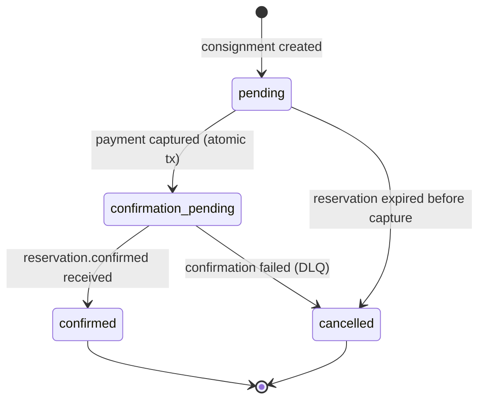
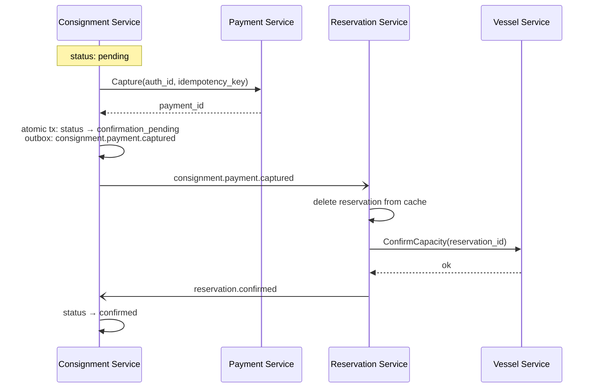
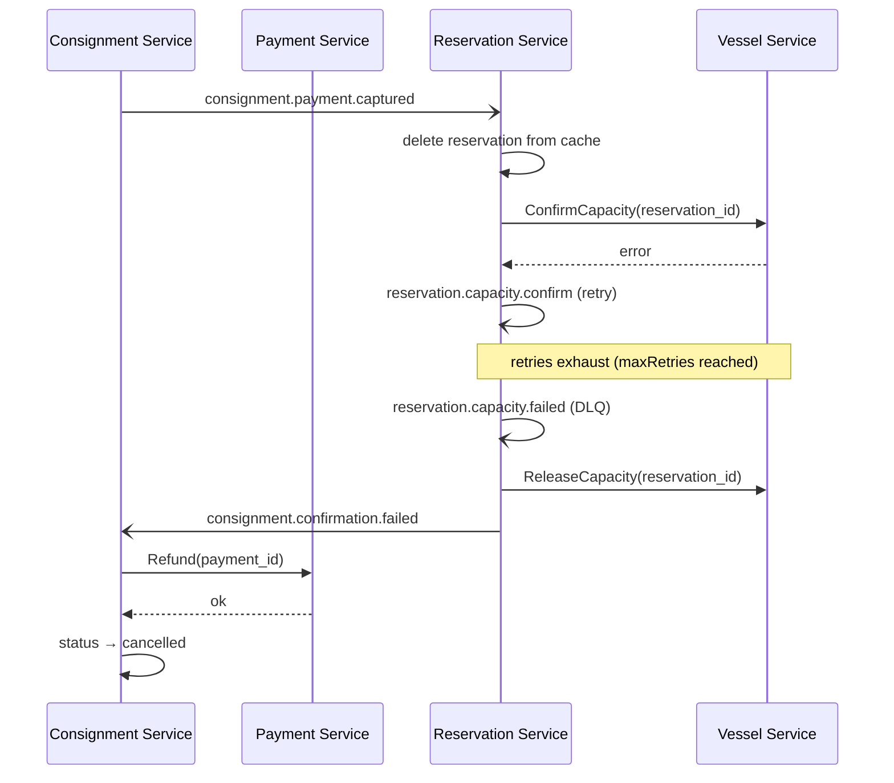
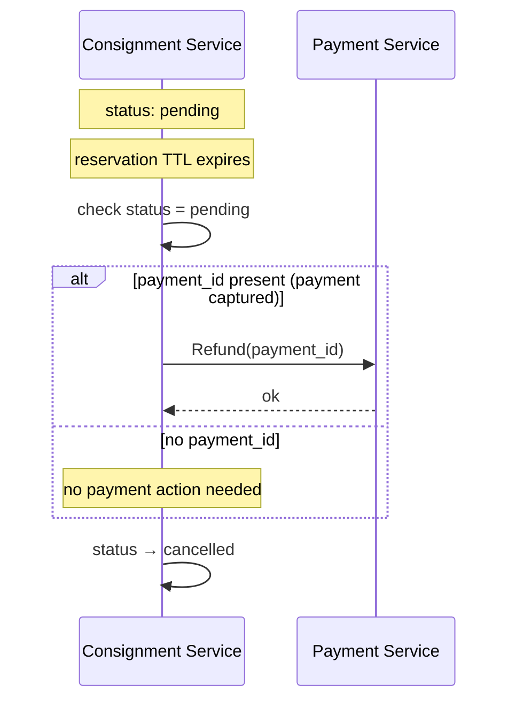
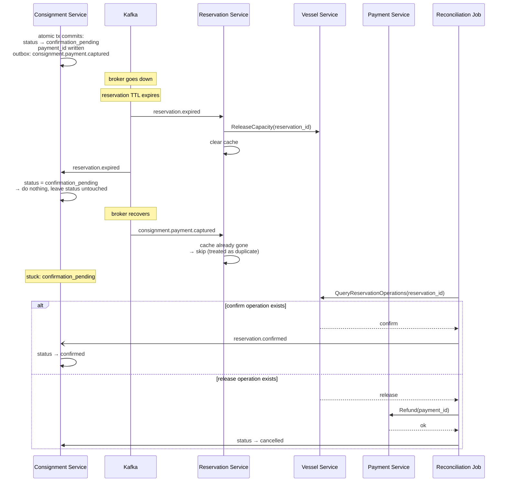

# Shippy Payment Saga — Diagrams

## Full Saga Overview

```mermaid
flowchart TD
    subgraph MAIN["Main Saga Flow"]
        A([Consignment created\nstatus: pending])
        A --> C[Capture payment\nwith retries]
        C -- fail, retries exhausted --> DLQ1[consignment.confirmation.failed]
        DLQ1 --> CANCEL1([Refund + Cancel])
        C -- success --> G["Atomic TX\n• write payment_id\n• status → confirmation_pending\n• outbox: payment.captured"]
        G -- TX fail → republish PaymentCaptured=true --> C
        G -- success --> J[RS: receive payment.captured]
        J --> K{Cache entry\nfound?}
        K -- no → duplicate, skip --> DONE0([done])
        K -- yes --> N[ConfirmCapacity on vessel\nwith retries]
        N -- fail, retries exhausted --> Q[reservation.capacity.failed DLQ]
        Q --> R[ReleaseCapacity on vessel]
        R --> S[consignment.confirmation.failed]
        S --> CANCEL2([Refund + Cancel])
        N -- success --> U[scheduleReservationConfirmed\nwith republish on failure]
        U --> X([status → confirmed ✓])
    end

    subgraph EXPIRY["Expiry Path — status still pending"]
        EXP1([Reservation TTL expires])
        EXP1 --> EXP2{payment_id\npresent?}
        EXP2 -- yes --> EXP3[Refund payment_id]
        EXP2 -- no --> EXP4[No payment action]
        EXP3 & EXP4 --> EXP5([status → cancelled])
    end
```

---

## Consignment Status State Machine

---

## Happy Path

---

## Failure Path — ConfirmCapacity Exhausts Retries

---

## Failure Path — Reservation Expires Before `confirmation_pending`

---

## Failure Path — Broker Outage After `confirmation_pending`, Reservation Expires

