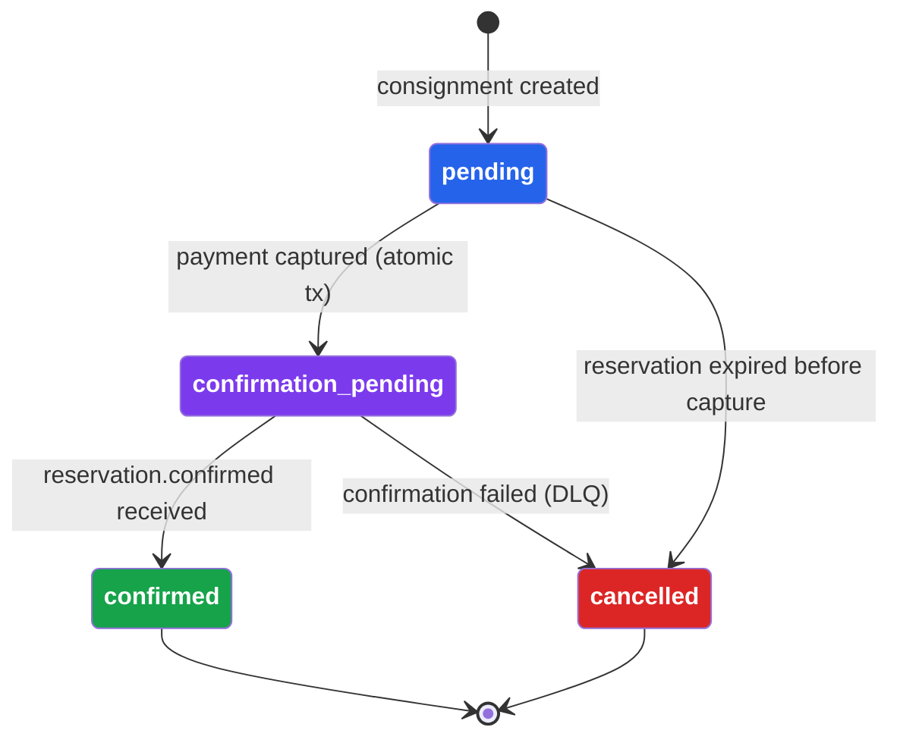
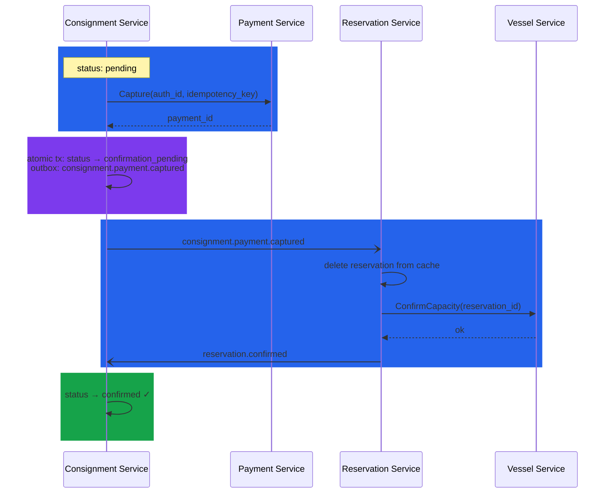
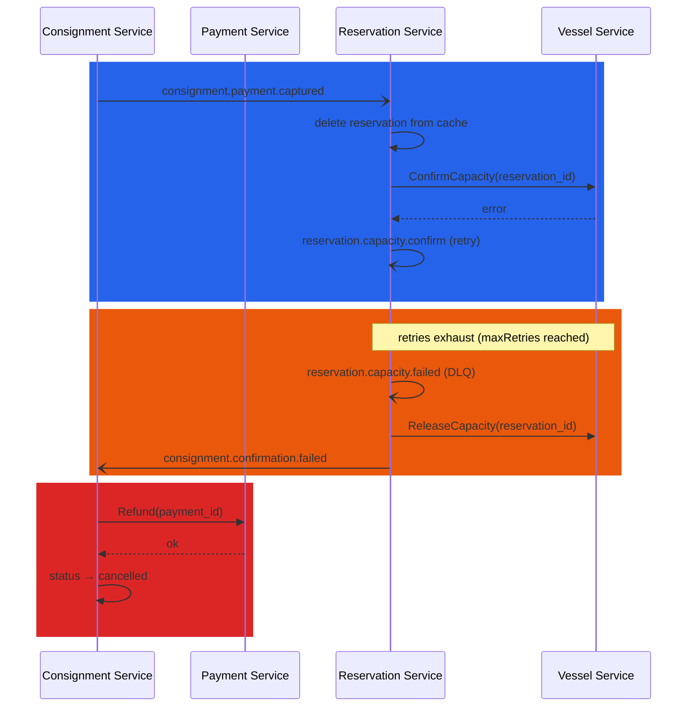
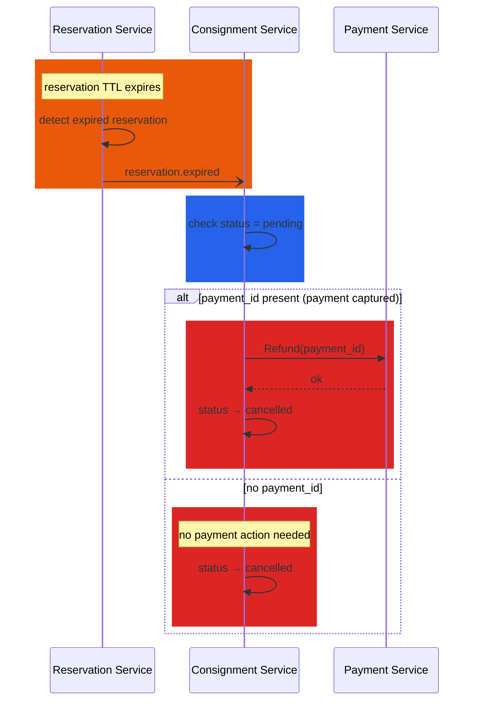
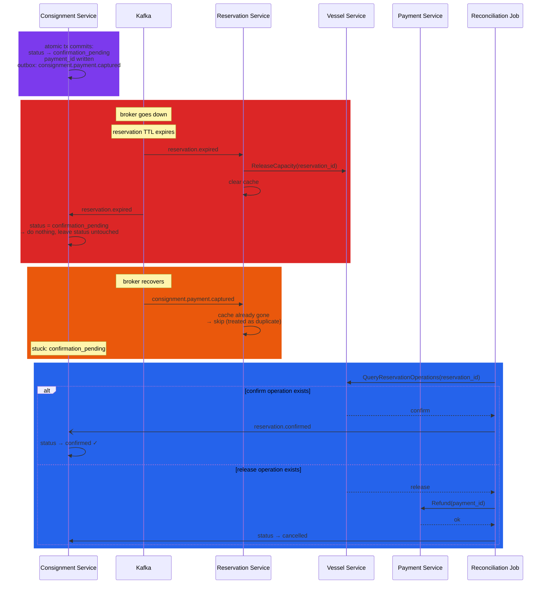

# Shippy Payment Saga — Technical Overview

Shippy uses a choreographed saga to coordinate consignment confirmation across three services: the Consignment Service (CS), Reservation Service (RS), and Vessel Service (VS). The saga begins when a payment is authorised and ends when vessel capacity is confirmed and the consignment marked as confirmed — or the payment is refunded and the consignment cancelled.

## Pattern

Services communicate via Kafka topics. No central orchestrator exists — each service reacts to events and publishes its own. The outbox pattern is used throughout: events are written to a DB outbox table within the same transaction as state changes, and a relay process publishes them to Kafka. This guarantees at-least-once delivery; all consumers are idempotent to handle duplicate events.

```mermaid
flowchart TD
    classDef success fill:#16a34a,stroke:#15803d,color:#fff
    classDef failure fill:#dc2626,stroke:#b91c1c,color:#fff
    classDef dlq fill:#ea580c,stroke:#c2410c,color:#fff
    classDef atomic fill:#7c3aed,stroke:#6d28d9,color:#fff
    classDef process fill:#2563eb,stroke:#1d4ed8,color:#fff
    classDef skip fill:#6b7280,stroke:#4b5563,color:#fff

    subgraph MAIN["Main Saga Flow"]
        A([Consignment created\nstatus: pending])
        A --> C[Capture payment\nwith retries]
        C -- fail, retries exhausted --> DLQ1[consignment.confirmation.failed]
        DLQ1 --> CANCEL1([Refund + Cancel])
        C -- success --> G["Atomic TX\n• write payment_id\n• status → confirmation_pending\n• outbox: payment.captured"]
        G -- TX fail → republish PaymentCaptured=true --> C
        G -- success --> J[RS: receive payment.captured]
        J --> K{Cache entry\nfound?}
        K -- no → duplicate, skip --> DONE0([done])
        K -- yes --> N[ConfirmCapacity on vessel\nwith retries]
        N -- fail, retries exhausted --> Q[reservation.capacity.failed DLQ]
        Q --> R[ReleaseCapacity on vessel]
        R --> S[consignment.confirmation.failed]
        S --> CANCEL2([Refund + Cancel])
        N -- success --> U[scheduleReservationConfirmed\nwith republish on failure]
        U --> X([status → confirmed ✓])
    end

    subgraph EXPIRY["Expiry Path — status still pending"]
        EXP1([Reservation TTL expires])
        EXP1 --> EXP2{payment_id\npresent?}
        EXP2 -- yes --> EXP3[Refund payment_id]
        EXP2 -- no --> EXP4[No payment action]
        EXP3 & EXP4 --> EXP5([status → cancelled])
    end

    class X success
    class CANCEL1,CANCEL2,EXP5 failure
    class DLQ1,Q,S dlq
    class G atomic
    class C,J,N,R,U,EXP3 process
    class DONE0 skip
```

---

## Consignment Status

The consignment status acts as the saga state machine:

- `pending` — created, awaiting payment capture
- `confirmation_pending` — payment captured, reservation / vessel capacity confirmation in flight
- `confirmed` — saga completed successfully
- `cancelled` — saga rolled back

---

## Happy Path

CS receives `consignment.payment.authorised` and captures the payment via a synchronous call to the Payment Service. On success, CS atomically transitions status to `confirmation_pending` and publishes `consignment.payment.captured`. This atomic write is the saga's point of no return — once committed, the saga must run to completion or be explicitly compensated.

RS consumes `consignment.payment.captured`, confirms capacity on VS, and publishes `reservation.confirmed`. CS consumes `reservation.confirmed` and sets status to `confirmed`.

---

## Failure Handling

**ConfirmCapacity fails** — RS retries internally. On retry exhaustion it releases the vessel capacity, then publishes `consignment.confirmation.failed`. CS consumes this, refunds the payment, and cancels the consignment.

**Payment capture fails** — CS retries internally. On exhaustion the event routes to `consignment.confirmation.failed`, payment is voided and the consignment is cancelled.

**Reservation expires while `pending`** — CS cancels the consignment and refunds if payment was captured. If the consignment is already `confirmation_pending` when expiry fires, CS does nothing — the saga is in flight and will resolve itself.

---

## Compensating Transactions

Each saga step that produces an external side effect has a corresponding compensating transaction. Steps 1 and 3 are the critical compensations — real external side effects (money and capacity). Steps 2 and 5 are pure DB state managed as a consequence of those compensations.

| # | Step | Owner | Compensating Transaction | Triggered By |
|---|------|-------|--------------------------|--------------|
| 1 | Capture payment | CS | Refund(`payment_id`) | `payment.captured` exhausts retries → DLQ and refunded; or reservation expires with `payment_id` present |
| 2 | status → `confirmation_pending` + publish `payment.captured` | CS | status → `cancelled` | Flows from step 3 compensation |
| 3 | ConfirmCapacity on vessel | RS | ReleaseCapacity on vessel | Retry exhaustion → DLQ |
| 4 | Publish `reservation.confirmed` | RS | Re-publish `reservation.confirmed` | Reconciliation job detects stuck `confirmation_pending` |
| 5 | status → `confirmed` | CS | — terminal, no compensation | — |

---

## Reconciliation (future improvement)

A periodic reconciliation job will catch consignments stuck in `confirmation_pending`. Rather than inferring state from event ordering, it queries VS directly — VS is the authoritative source of truth for what actually happened to a reservation. If VS recorded a confirm, the job re-triggers confirmation. If VS recorded a release, the job refunds and cancels. If the reservation was neither confirmed nor cancelled, investigation and event sourcing would be required.

The broker outage scenario below illustrates why the reconciliation job is necessary — the saga can reach a state it cannot self-recover from without external intervention.

---

## Known Limitations

If the Kafka broker is down for longer than the reservation TTL, a race exists where both the expiry and payment capture events publish after recovery. The outcome depends on which the RS processes first, and in the worst case a captured payment may have no automated refund path. This is an accepted limitation given the operational probability involved.

See [known-limitations.md](known-limitations.md) for the full list of accepted limitations.
